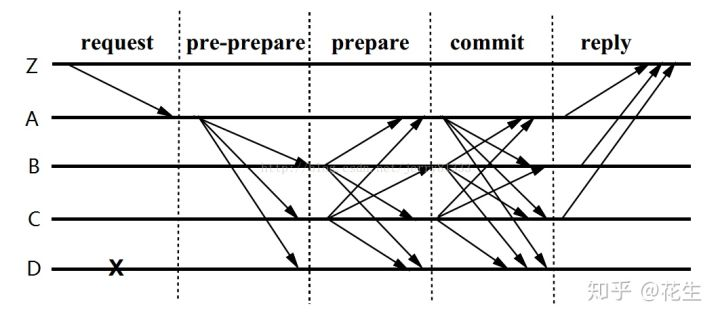

拜占庭将军问题与PBFT算法和POW共识
------

## 拜占庭将军问题
Leslie Lamport(莱斯利·兰波特)在论文《The Byzantine Generals Problem》提出拜占庭将军问题：

> 一组拜占庭将军分别各率领一支军队共同围困一座城市。为了简化问题，将各支军队的行动策略限定为进攻或撤离两种。因为部分军队进攻部分军队撤离可能会造成灾难性后果，因此各位将军必须通过投票来达成一致策略，即所有军队一起进攻或所有军队一起撤离。因为各位将军分处城市不同方向，他们只能通过信使互相联系。在投票过程中每位将军都将自己投票给进攻还是撤退的信息通过信使分别通知其他所有将军，这样一来每位将军根据自己的投票和其他所有将军送来的信息就可以知道共同的投票结果而决定行动策略。

出现的问题：

假如有5支部队，低于3支部队则无法攻打下来反而会被反攻，有2支部队选择进攻，2支选择撤退，这时候出现一个叛徒，对其中2支选择进攻的部队送信说要进攻，选择进攻的部队一看有3支部队选进攻则进攻；叛徒对2支选择撤退的部队送信说要撤退，选择撤退的部队一看有3支部队选撤退则撤退了，最终3支部队攻城失败，整个部队失败。一致性遭到破坏。
也可能送信的过程中，送信人被敌人截杀，部队一直不能收到所有其他部队传递过来的消息。

## 分布式计算机系统

以上问题放到计算机系统中，各支部队便是计算机，信差便是通信系统。

## PBFT（Practical Byzantine Fault Tolerance）实用拜占庭容错

PBFT算法的核心理论是N>=3F+1，其中N是总节点数，F是故障节点（故障包括叛徒或不响应）。假如有F个故障节点，至少有3F+1个节点才能保证整个系统正确运行。

算法要求至少要4个参与者ABCD，1个为总司令，3个师长

没有叛徒：

1. 4个将军分别为ABCD，选举A为总司令，总统（终端用户）向A说进攻
2. A对BCD说进攻
3. BCD都各自对其他节点说进攻
4. 每个节点都收到其他人说进攻的指令，则进攻

假如出现1个叛徒D：

1. A对BCD说进攻
2. D对BC说撤退
3. 对B而言，A和C说进攻（2票）大于D说撤退（1票），进攻

假如出现2个叛徒CD：

1. A对BCD说进攻
2. CD对B说撤退，撤退
3. A又进攻，一致性失败

所以当有4个节点时，只能容许1个节点出问题，该问题可能是叛徒（伪造消息）或者没有消息（无响应）

实际上PBFT会更复杂一些，分为预准备（pre-prepare）、准备(prepare)和确认(commit)

1. request：总统Z向A发消息
2. pre-prepare：服务端0收到C的请求后进行广播，扩散至ABC
3. prepare：BCD,收到后记录并再次广播，B->ACD，C->ABD，D因为宕机无法广播
4. commit:ABCD节点在Prepare阶段，若收到2F（F为可容忍错误个数）个或以上和自己相同的请求，则进入Commit阶段，广播Commit请求
5. reply：ABCD节点在Commit阶段，若收到2F+1个的相同请求，则对C进行反馈
加入出现1个伪装节点D，对于B号节点来说，有A、C号节点和自己相同，大于等于2F个即2个，则进入commit阶段，并告知其他节点；同理对于A号节点和C号节点也会进入commit阶段。最终有ABC三个节点进入commit阶段，3个请求满足2F+1个即3个，它们会对Z进行反馈。

- 为什么是3F+1

容错，就是不需要等待的数量，当有4个节点，只需要有3个节点反馈数据就立即决策了，那么3个有可能是一个是有伪装的，这种情况下也能保证系统一致性（节点不能无限制的等待所有其他节点都发数据过来，他只需要等待N-F即2F+1个反馈）。

1. 如果未接到反馈的恰好是叛徒节点，剩下的全都保持一致，没有问题。
2. 如果未反馈的是好节点，叛徒节点只有1票，则2个好节点>1个叛徒，系统正常。
3. 3F+1。系统只等N-F个就做决策。极端情况下，所有的F个叛徒都先发数据，那么剩下的必须必须是F+1个正确的节点才能保证 F+1个叛徒 > F个叛徒，那么所有N的节点为（F+1个收到的节点 + F个未收到节点 + F个叛徒）也就是3F+1个。

## 比特币POW（Proof Of Word）工作量证明

比特币通过工作量证明来解决一致性问题，通过数学的方式，让其中一个节点成为当前情况下的总司令，后续所有的命令都是根据该结果来进行。

举例来到将军问题，先假定某个数序规则Puzzle需要将军的军师平均花一天即24小时的时间才能解开。每次算出来的将军可以获得总司令给的军械奖励。

1. 任何一个将军都可以说6天后进攻或撤退，然后根据‘6天后进攻’或者‘6天后撤退’内容按照Puzzle规则进行计算。
2. 将军A花了23个小时率先发现‘天行健’和‘6天后进攻’符合Puzzle规则，于是他送信给其他将军。
3. 其他将军收到该信息之后，下一步‘攻击东城门’或者‘攻击西城门’，根据‘6天后进攻&天行健&A#攻击东城门’或‘6天后进攻&天行健&A#攻击西城门’作为内容按照Puzzle规则进行计算。
4. 将军B花了25个小时率先发现‘天圆地方’和‘6天后进攻&天行健&A#攻击东城门’符合Puzzle规则，于是他送信给其他将军。
5. 其他将军收到该信息之后，下一步‘使用云梯’或者‘使用攻城锤’，根据‘6天后进攻&天行健&A#攻击东城门&天圆地方&B#使用云梯’或‘6天后进攻&天行健#攻击东城门&天圆地方&B#使用攻城锤’作为内容按照Puzzle规则进行计算。
6. 一直重复以上4、5。

为了获得奖励，他们一般都是谁先到这里就根据谁的算。并且谁的指令最长最有可能被司令认可获得奖励军械，这样，所有的将军都会在第六天进行进攻。

其中的问题：

1. 在步骤2将军Z也花了23个小时发现‘自强不息’和‘6天后撤退’符合Puzzle规则，也送信给其他将军。那么其他将军一部分根据将军A的结果往下算，一部分根据将军Z的结果往下算，在第二天谁最先解开Puzzle那么极有机会率先通知其他将军。结果将军B率先发现第二个Puzzle，并通知了70%的将军的时候，这70%的将军解开第三个Puzzle的概率远远大于剩下的30%的将军解开第三个Puzzle。到第四个Puzzle的时候就可能变成90%：10%，第五个Puzzle的时候变成98%：3%，第六个Puzzle的时候变成99.99%：0.01%。这样差不多所有将军都会进行进攻。（即为比特币的6次确认可以判定交易真实）
2. 也可能将军Z胜出，只不过上面的比例反过来，那么内容变成‘6天后撤退&人之初&Z#向东撤退5公里&赵钱孙&Y#扎营做饭&弟子规&X’等。但是并不影响第6天他们集体进攻还是撤退。

## 总结

1. PBFT算法要求知道节点数是确定的，比如22个节点，那么F可以为7，有15个节点的数据即可做决定，适合联盟链
2. POW共识不限定节点数，不是实时结算的，一般而言6次确认之后基本上没有问题

## 参考

维基百科：[拜占庭将军问题](https://zh.wikipedia.org/wiki/%E6%8B%9C%E5%8D%A0%E5%BA%AD%E5%B0%86%E5%86%9B%E9%97%AE%E9%A2%98)

维基百科：[工作量证明](https://zh.wikipedia.org/wiki/%E5%B7%A5%E4%BD%9C%E9%87%8F%E8%AD%89%E6%98%8E)
