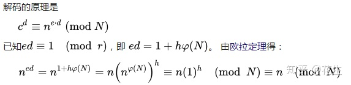

RSA公钥私钥加密算法
-----

## 数论

1. 一个大于1的自然数，除了1和它自身外，不能被其他自然数整除的数叫做质数；否则称为合数。质数如2、3、5、7
2. 每一个合数都可以以唯一形式被写成质数的乘积，即分解质因数。
3. 对于大数而言，目前来说没有很好的分解质因数方法，一般而言，计算机从2开始一个个测试来判断是否为质因数。
4. 欧拉函数O(n)是小于或等于n的正整数中与n互质的数的数目。
5. 模反元素：如果两个正整数a和n互质，那么一定可以找到整数b，使得 ab-1 被n整除，或者说ab被n除的余数是1。这时，b就叫做a的“模反元素”。比如a=3，n=11;则b=4。实际上4加减11的整数倍都是3的模反元素 {…,-18,-7,4,15,26,…}，即b+kn都是a的模反元素
6. 欧拉定理：即a的O(n)次方与1在模n下同余；O(n)为欧拉函数。如上n=11，O(n)=10，a的O(n)次方为3的10次方等于=59049=（5368*11 + 1）。（同余：两个整数a，b，若它们除以正整数m所得的余数相等，则称a， b对于模m同余，如26等于14(mod12)）

## RSA算法

RSA加密算法是一种非对称加密技术，即加密时候用的密钥（公钥）和解密时用的密钥（私钥）不是同一把。

基本原理是将两个很大的质数相乘很容易得到乘积，但是该乘积分解质因数却很困难。

也就是说对就计算机来说997210243分解质因数很困难，只能从2、3、5一个个测试。而计算9973 * 99991 = 997210243却很容易。

## 公钥与私钥的产生

1. 随意选择两个大质数p和q，p不等于q，计算出N=p*q
2. 根据欧拉函数，任何质数p的互质数目为p-1，另r=O(N)=O(p)O(q)=(p-1)(q-1)
3. 选择一个小于r的整数e，另r和e互质，求e关于r的模反元素为d。
4. 将p和q的记录消除
5. (N, e)为公钥；（N，d）为私钥。

如p=11, q=2; 则N=22, r=10。 选择e=3, d可以为7,17,27（7+10k）

公钥为(22, 3)， 私钥为(22, 7)

## 加密消息
原始信息为n，加密动作为：

c = n的e次方 (mod N)

如上例，原始数据6，6的3次方为216， (mod 22) 后为18

注：原始数据n必须小于N，当p和q足够大的时候是没问题的

## 解密消息

现在要通过c和私钥(N,d)将c解密出n。

c的d次方 = n （mod N）

如上例 18的7次方=612220032，(mod 22)后为6； 18的17次方2185911559738696531968，(mod 22)后22也为6

## 安全性
假设偷听者乙获得了甲的公钥N和e以及丙的加密消息c，但她无法直接获得甲的密钥d。

根据公式 e*d = 1 (mod (p-1)(q-1))，那么最简单的方式就是分解N的质因数p和q。

但至今为止还没有人找到一个多项式时间的算法来分解一个大的整数的因子，同时也还没有人能够证明这种算法不存在。

## 参考

维基百科：[质因数分解](https://zh.wikipedia.org/wiki/%E6%95%B4%E6%95%B0%E5%88%86%E8%A7%A3)

维基百科：[模反元素](https://zh.wikipedia.org/wiki/%E6%A8%A1%E5%8F%8D%E5%85%83%E7%B4%A0)

维基百科：[欧拉函数](https://zh.wikipedia.org/wiki/%E6%AC%A7%E6%8B%89%E5%87%BD%E6%95%B0)

维基百科：[欧拉定理](https://zh.wikipedia.org/wiki/%E6%AC%A7%E6%8B%89%E5%AE%9A%E7%90%86_(%E6%95%B0%E8%AE%BA))

维基百科：[RSA加密解密算法](https://zh.wikipedia.org/wiki/RSA%E5%8A%A0%E5%AF%86%E6%BC%94%E7%AE%97%E6%B3%95)